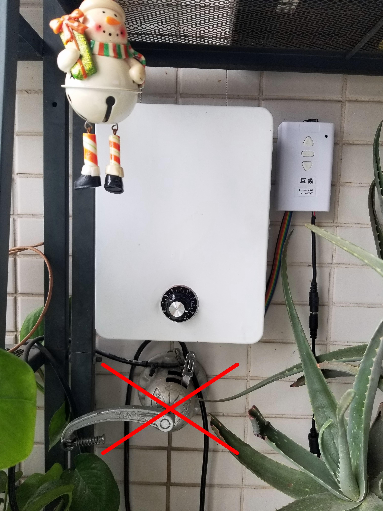

Have you ever been bothered that after a perfect bath you have to stand in the cold winter wind more than one minute to put your underwear onto the clothes dryer, just because the old crank doesn't work fluently? I have, it's really painful for a person like me that doesn't like cold weather in the winter. What I need is an automatic dryer that I can control remotely in the room. I built one, with less money but flexible functionalities.

Let's see what features it has:
- Motor driven
- Mechanical position limitation
- Linear positioning with optical encoder
- Linear height control with analog rotator
- RF control
- MQTT control

<!-- more -->

I fixed it on the wall of balcony of my house, replaced the old crank of this liftable clothes dryer.

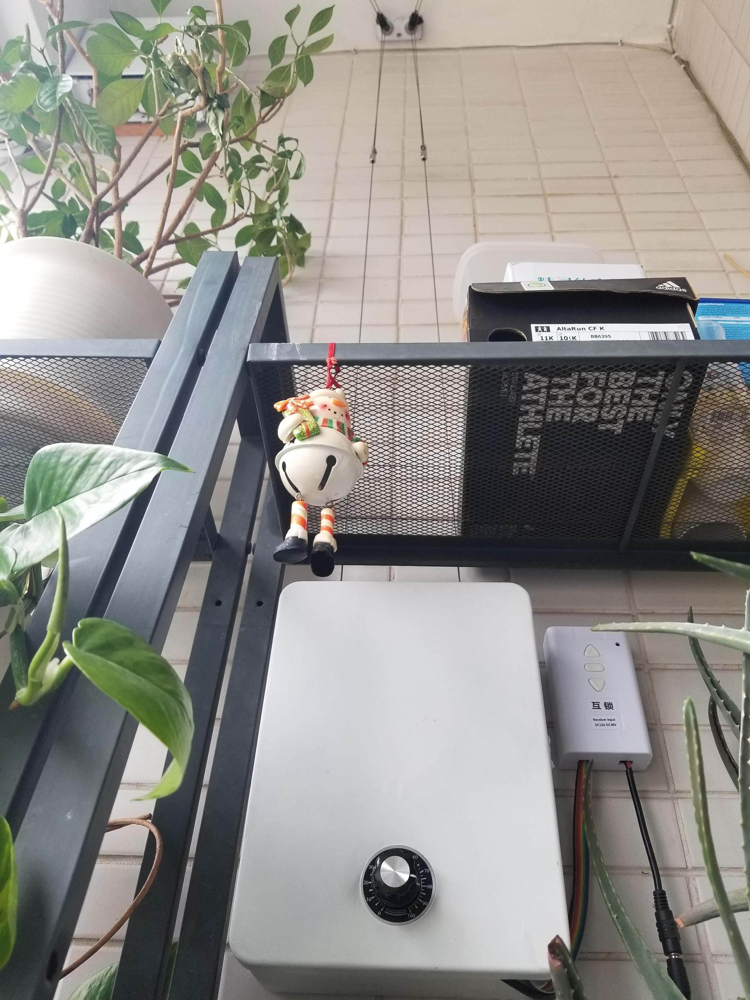


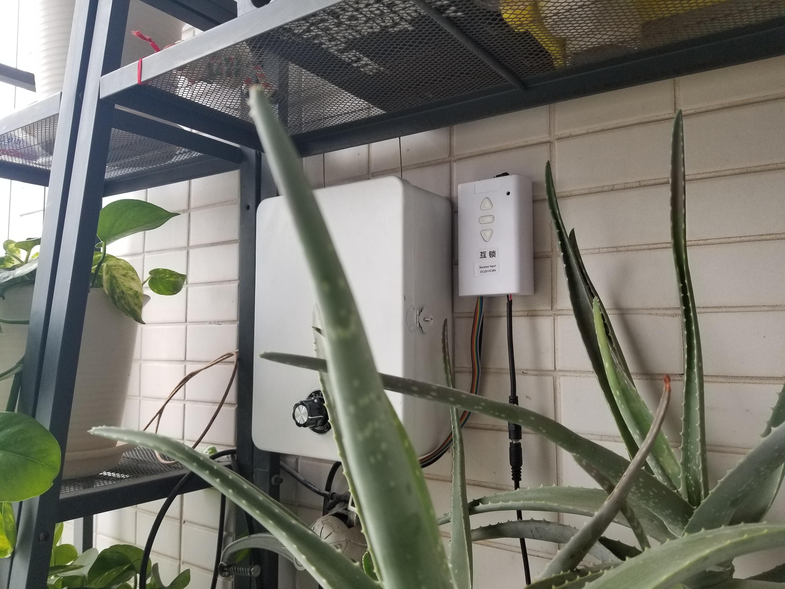


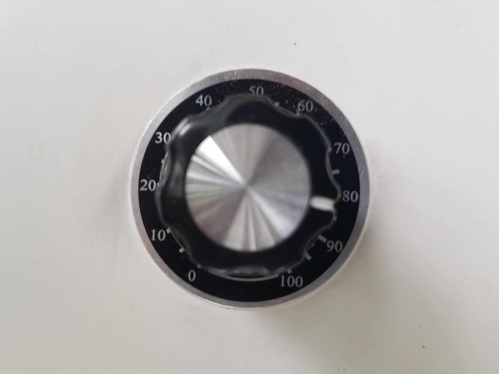

The motor controller with RF - I bought it from taobao.com of alibaba.

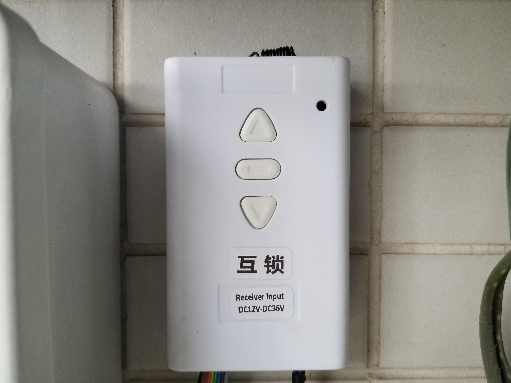

The closure is made of a gift box. I cut a window on the top to let the lifting rope go through.

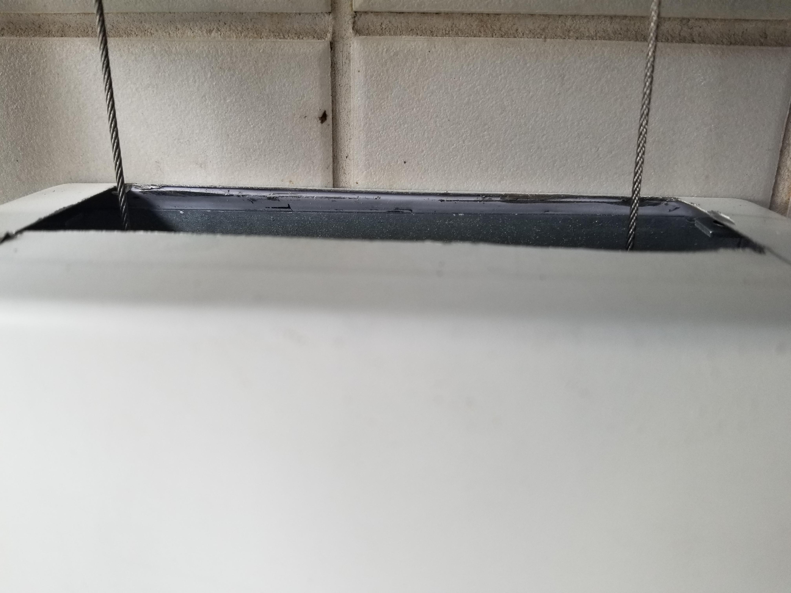

This is all the stuff inside the box, including motor, rope spooler, optical encoder, another controller board and a DC-DC convertor.

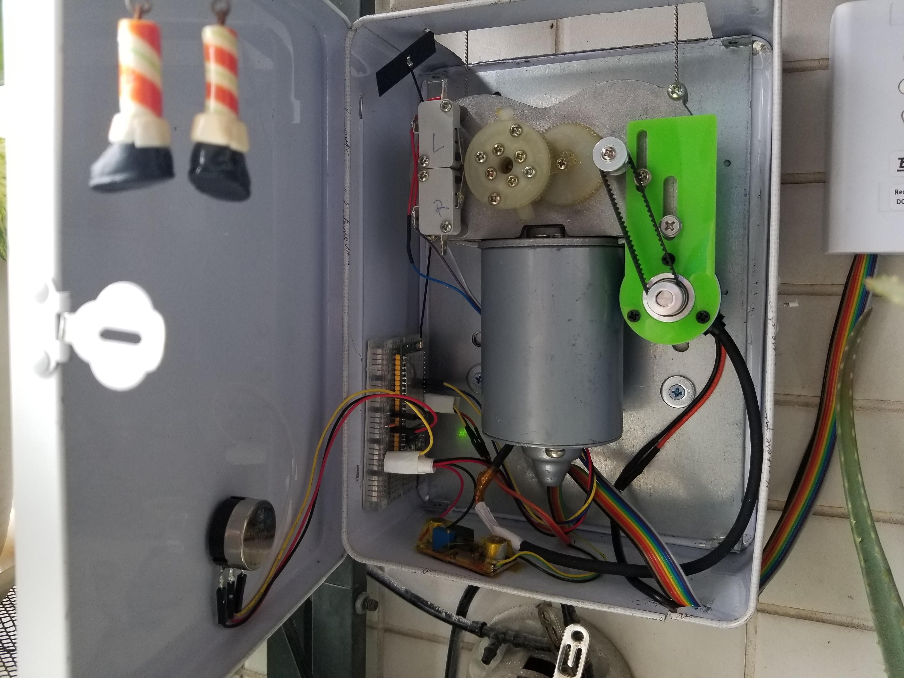

Rope spooler.

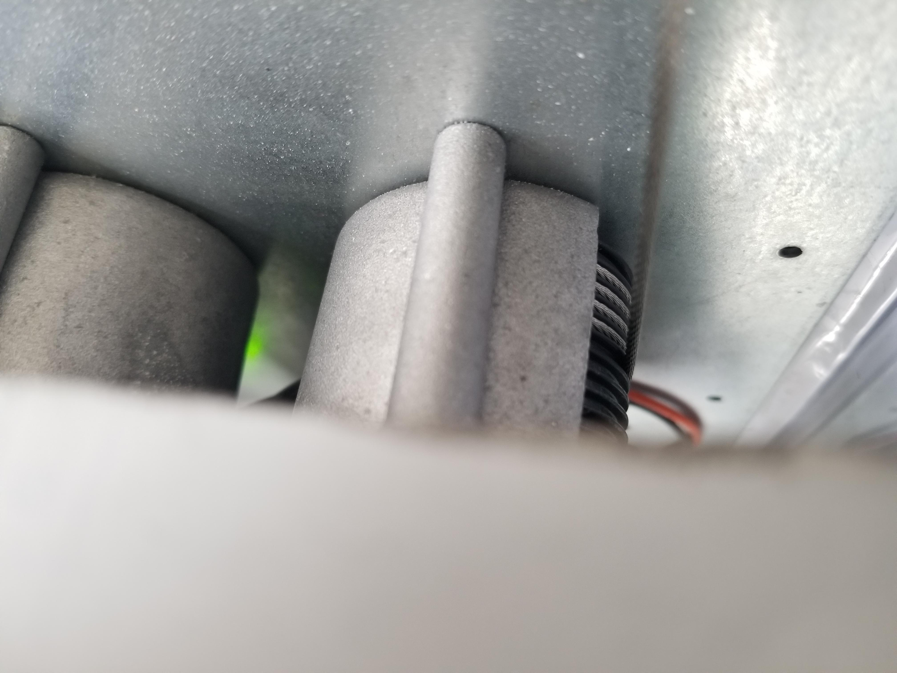


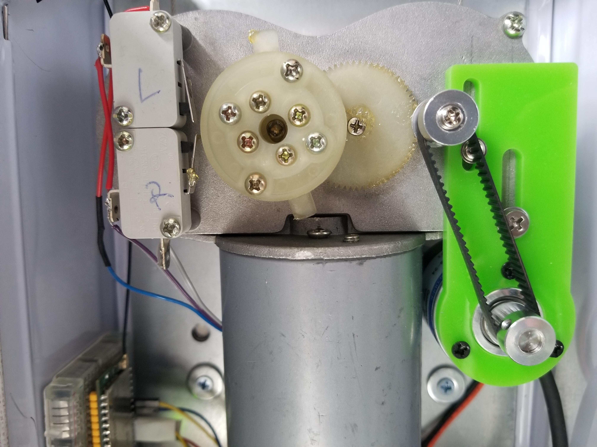

This is another controller board which communicates with the motor controller. The motor controller has extensional GPIOs for controlling the motor to UP/DOWN/STOP from outside.

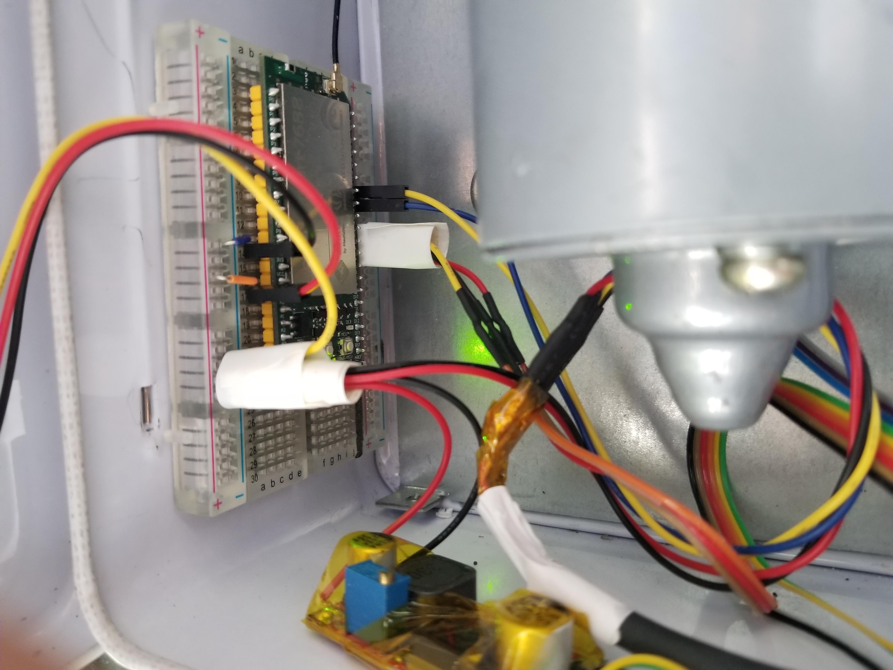

The first function I want to have is the MQTT control, with which I can include this auto dryer into my home-assistant system. This means that I need the WiFi connection for the controller, I used the [Linkit Smart 7688 Duo](https://www.seeedstudio.com/LinkIt-Smart-7688-Duo-p-2574.html) board from [SeeedStudio](seeedstudio.com). This board is a powerful little piece with low cost, it has:
- 580 MHz MIPS CPU 
- Single input single output(1T1R) Wi-Fi 802.11 b/g/n (2.4G) 
- Pin-out for GPIO, I2C, SPI, SPIS, UART, PWM and Ethernet Port 
- 32MB Flash and 128MB DDR2 RAM
- USB host
- Micro SD slot 
- Support for Arduino (ATmega32U4) 


So I got a system diagram like this:

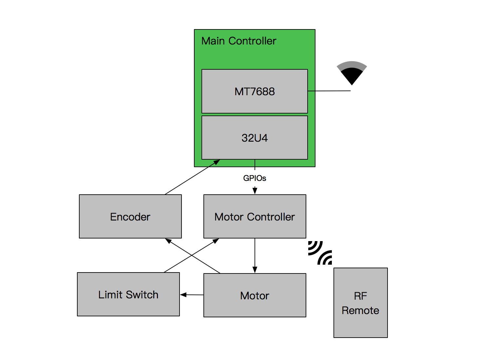

## Programming

### Arduino

```C++
#include <math.h>
#include <avr/eeprom.h>
#include <EEPROM.h>
#include <Wire.h>
#include <Encoder.h>
#include <SoftwareSerial.h>


//status
#define ST_STOP                 0
#define ST_UP                   1
#define ST_TITTLE_UP            2
#define ST_DOWN                 3
#define ST_TITTLE_DOWN          4
#define ST_MUST_STOP            5
#define ST_RUN                  6
#define ST_IDLE                 100

// pins
#define PIN_KNOB                A0

#define PIN_UP                  7
#define PIN_STOP                6
#define PIN_DOWN                5

#define PIN_ENC_A               2
#define PIN_ENC_B               3

// knob
#define THRES_KNOB                  25     //3cm resolution
#define KNOB_AVG_TIMES              10
#define KNOB_WAIT_TIME_BEFORE_STOP  100    //ms

// motor
#define MOTOR_CTRL_PULSE            250    //ms

// others
#define ENABLE_SLOWTASK             true
#define SLOW_LOOP_DURATION          10000

#define TITTLE_UP_THRES             200
#define TITTLE_DOWN_THRES           200
#define DEADZONE                    50

#define DEBUG_SER                   Serial
#define COMM_SER                    Serial1


int key = -1;
int status = -1;
int last_status = -1;
boolean auto_mode = false;
boolean was_moving = false;
boolean triggered = false;
int32_t cur_pos, target_pos, total_len, last_saved_pos;
int32_t trigger_all_lux, trigger_half_lux;

long last_slow_loop_time, last_save_pos_time;
float temp = 0;
unsigned long lux = 0;

uint32_t cur_knob, last_knob, sum_knob, knob_sum_cnt;
bool knob_moving = false;
long last_knob_move_time;


//SoftwareSerial mySerial(10, 11); // RX, TX
Encoder encoder(PIN_ENC_A, PIN_ENC_B);
long encoder_pos;

String recv_buffer;

void setup()
{
  pinMode(PIN_UP, OUTPUT);
  pinMode(PIN_STOP, OUTPUT);
  pinMode(PIN_DOWN, OUTPUT);

  digitalWrite(PIN_UP, 1);
  digitalWrite(PIN_STOP, 1);
  digitalWrite(PIN_DOWN, 1);

  COMM_SER.begin(57600);
  DEBUG_SER.begin(115200);

  COMM_SER.setTimeout(10);

  DEBUG_SER.println("> on-start...");

//  save_pos_to_eeprom(0);
//  save_len_to_eeprom(2000);

  restore_len_from_eeprom(&total_len);
  restore_pos_from_eeprom(&cur_pos);

  target_pos = cur_pos;
  encoder.write(cur_pos);
  last_saved_pos = -1;

  last_knob = cur_knob = analogRead(PIN_KNOB);
  sum_knob = knob_sum_cnt = 0;

  recv_buffer.reserve(64);

  DEBUG_SER.print("> init over!\r\n> cur_pos: ");
  DEBUG_SER.print(cur_pos);
  DEBUG_SER.print(", total_len: ");
  DEBUG_SER.println(total_len);

}

void loop()
{
  process_air_commands();
  
  process_knob_action();

  process_position_fixing();
  
  state_machine_process_state();

  //slow task
  if (millis() - last_slow_loop_time > SLOW_LOOP_DURATION && ENABLE_SLOWTASK)
  {
    last_slow_loop_time = millis();
    do_slow_task();
  }
  
  delay(10);
}

void process_air_commands()
{
  int cnt = COMM_SER.available();
  
  if (cnt > 0) {
//    //clear the string
//    for (int i = 0; i < recv_buffer.length(); i++) {
//      recv_buffer.setCharAt(i, '\0');
//    }
//    //fill the string
//    int j = 0;
//    while (cnt-- > 0) {
//      recv_buffer.setCharAt(j, COMM_SER.read());
//    }
    recv_buffer = COMM_SER.readStringUntil('\r');

    DEBUG_SER.print("> recv string: ");
    DEBUG_SER.println(recv_buffer);

    //parse the string
    if (recv_buffer.indexOf("C0") > -1) {
      //calibrate pos 0
      target_pos = cur_pos = -20;
      encoder.write(0);
      save_pos_to_eeprom(cur_pos);
    } else if (recv_buffer.indexOf("C100") > -1) {
      //calibrate pos 100
      if (cur_pos > 0)
      {
          total_len = cur_pos - 20;
          save_pos_to_eeprom(cur_pos); 
          save_len_to_eeprom(total_len);
          DEBUG_SER.print("> total_len: ");
          DEBUG_SER.println(total_len); 
      }
    } else if (recv_buffer.indexOf("OPEN") > -1) {
      target_pos = 0;
      triggered = true;
    } else if (recv_buffer.indexOf("CLOSE") > -1) {
      target_pos = total_len;
      triggered = true;
    } else if (recv_buffer.indexOf("STOP") > -1) {
      target_pos = cur_pos;
      triggered = true;
    } else if (recv_buffer.indexOf("POS") > -1) {
      String pos_str = recv_buffer.substring(recv_buffer.indexOf("POS") + 3);
      int pos = pos_str.toInt();
      DEBUG_SER.print("> recv pos: ");
      DEBUG_SER.println(pos);
      if (pos >= 0 && pos <= 100) {
        target_pos = map(pos, 0, 100, total_len, 0);
        triggered = true;
      }
    }

    recv_buffer = "";
  }
}

void send_pos_to_air(int32_t pos)
{
  int p = map(pos, 0, total_len, 100, 0);
  COMM_SER.println(p, DEC);

  if (p <= 2) {
    COMM_SER.println("closed");
  }
  if (p >= 98) {
    COMM_SER.println("open");
  }
}

void process_knob_action()
{
  sum_knob += analogRead(PIN_KNOB);
  knob_sum_cnt++;
  if (knob_sum_cnt >= KNOB_AVG_TIMES) {
    knob_sum_cnt = 0;
    cur_knob = sum_knob / KNOB_AVG_TIMES;
    sum_knob = 0;
  } else {
    return;
  }

  

  if (abs(cur_knob - last_knob) > THRES_KNOB) {
    knob_moving = true;
    last_knob_move_time = millis();
    last_knob = cur_knob;

    DEBUG_SER.print("> cur_knob: ");
    DEBUG_SER.print(cur_knob);
    DEBUG_SER.print(", delta knob: ");
    DEBUG_SER.println(abs(cur_knob - last_knob));

  
  } else {
    if (knob_moving && (millis() - last_knob_move_time) > KNOB_WAIT_TIME_BEFORE_STOP) {
      knob_moving = false;
      // just stop, should take some actions
      target_pos = map(last_knob, 0, 1023, 0, total_len);
      triggered = true;
      
      DEBUG_SER.print(">target pos was set by knob: ");
      DEBUG_SER.println(target_pos);
    }
  }
}

/**
   Position fixing and state transfer
*/
void process_position_fixing()
{
  //read position
  cur_pos = encoder.read();
//  DEBUG_SER.print("> cur pos: ");
//  DEBUG_SER.println(cur_pos);

  //down
  if (target_pos - cur_pos > DEADZONE && triggered)
  {
//    if (target_pos - cur_pos < TITTLE_DOWN_THRES)
//    {
//      status = ST_TITTLE_DOWN;
//    } else
      status = ST_DOWN;
  }
  //up
  else if (target_pos - cur_pos < -DEADZONE && triggered)
  {
//    if (target_pos - cur_pos > -TITTLE_UP_THRES)
//    {
//      status = ST_TITTLE_UP;
//    } else
      status = ST_UP;
  }
  else if (triggered)
  {
    status = ST_STOP;
    triggered = false;
  }
}

void state_machine_process_state()
{
  switch (status)
  {
    case ST_UP:
      if (last_status != ST_UP) {
        motor_up();
        was_moving = true;
      }
      if (millis() - last_save_pos_time > 5000)
      {
        save_pos_to_eeprom(cur_pos); last_save_pos_time = millis();
        send_pos_to_air(cur_pos);
      }
      last_status = ST_UP;
      break;
//    case ST_TITTLE_UP:
//      motor_up();
//      delay(abs(cur_pos - target_pos));
//      motor_stop();
//      delay(10);
//      was_moving = true;
//      last_status = ST_TITTLE_UP;
//      break;
    case ST_DOWN:
      if (last_status != ST_DOWN) {
        motor_down();
        was_moving = true;
      }
      if (millis() - last_save_pos_time > 5000)
      {
        save_pos_to_eeprom(cur_pos); last_save_pos_time = millis();
        send_pos_to_air(cur_pos);
      }
      last_status = ST_DOWN;
      break;
//    case ST_TITTLE_DOWN:
//      motor_down();
//      delay(abs(cur_pos - target_pos));
//      motor_stop();
//      delay(100);
//      was_moving = true;
//      last_status = ST_TITTLE_DOWN;
//      break;
    case ST_MUST_STOP:
    case ST_STOP:
      if (last_status != ST_STOP) motor_stop();
      if (was_moving)
      {
        was_moving = false;
        save_pos_to_eeprom(cur_pos); last_save_pos_time = millis();
        send_pos_to_air(cur_pos);
      }
      last_status = ST_STOP;
      break;      
    default:
      break;
  }
}

void do_slow_task()
{
  DEBUG_SER.println("> ---- slow task start ----");
  DEBUG_SER.print("# cur pos: ");
  DEBUG_SER.println(cur_pos);
  DEBUG_SER.print("# target pos: ");
  DEBUG_SER.println(target_pos);
  DEBUG_SER.print("# status: ");
  DEBUG_SER.println(status);
  if (cur_pos != last_saved_pos) {
    save_pos_to_eeprom(cur_pos); last_save_pos_time = millis();
    send_pos_to_air(cur_pos);
  }
  DEBUG_SER.println("> ---- slow task end ----");
}

void motor_up()
{
  DEBUG_SER.println("!!! up");
  pinMode(PIN_UP, OUTPUT);
  digitalWrite(PIN_UP, 0);
  delay(MOTOR_CTRL_PULSE);
  digitalWrite(PIN_UP, 1);
  pinMode(PIN_UP, INPUT_PULLUP);
}

void motor_down()
{
  DEBUG_SER.println("!!! down");
  pinMode(PIN_DOWN, OUTPUT);
  digitalWrite(PIN_DOWN, 0);
  delay(MOTOR_CTRL_PULSE);
  digitalWrite(PIN_DOWN, 1);
  pinMode(PIN_DOWN, INPUT_PULLUP);
}

void motor_stop()
{
  DEBUG_SER.println("!!! stop");
  pinMode(PIN_STOP, OUTPUT);
  digitalWrite(PIN_STOP, 0);
  delay(MOTOR_CTRL_PULSE);
  digitalWrite(PIN_STOP, 1);
  pinMode(PIN_STOP, INPUT_PULLUP);
}

void save_4byte(int addr, uint32_t value)
{
  //EEPROM.write(addr, value & 0xff);
  //EEPROM.write(addr + 1, (value >> 8) & 0xff);
  //EEPROM.write(addr + 2, (value >> 16) & 0xff);
  //EEPROM.write(addr + 3, (value >> 24) & 0xff);
  eeprom_write_block((const void *)&value, (void *)addr, sizeof(uint32_t));
}

void restore_4byte(int addr, uint32_t *value)
{
  //long v;
  //uint8_t tmp;
  //tmp = EEPROM.read(addr);
  //v = tmp & 0xff;
  //tmp = EEPROM.read(addr+1);
  //v |= (tmp << 8);
  //tmp = EEPROM.read(addr + 2);
  //v |= (tmp << 16);
  //tmp = EEPROM.read(addr + 3);
  //v |= (tmp << 24);
  //*value = v;
  eeprom_read_block((void *)value, (void *)addr, sizeof(uint32_t));
}

void save_len_to_eeprom(int32_t value)
{
  save_4byte(0, value);
}

void restore_len_from_eeprom(int32_t *value)
{
  restore_4byte(0, (uint32_t *)value);
}

void save_pos_to_eeprom(int32_t value)
{
  DEBUG_SER.print("=> save pos to eep: ");
  DEBUG_SER.println(value);
  
  save_4byte(4, value);
  last_saved_pos = value;
}

void restore_pos_from_eeprom(int32_t *value)
{
  restore_4byte(4, (uint32_t *)value);
}
```

### Python script in OpenWrt

The MT7688 runs the OpenWrt system, it's easy to program very complex logic there. I used my favorite programming language - `Python`. What I wrote is a bridge, between the Serial and MQTT.

```Python
#!/usr/bin/env python

import os
import sys
import atexit
import signal
import paho.mqtt.client as mqtt
import serial

SERIAL_PORT = '/dev/ttyS0'
SERIAL_BAUDRATE = 57600

MQTT_SERVER = '192.168.4.48'
MQTT_PORT = 1883
MQTT_USER = 'xxx'
MQTT_PWD = 'xxx'
MQTT_CLIENTID = 'autorack'
MQTT_KEEPALIVE_INTERVAL = 15
MQTT_ALIVE_TOPIC = 'rack/alive'
MQTT_CMD_TOPIC = "rack/cmd"
MQTT_SETPOS_TOPIC = "rack/setpos"
MQTT_STATE_TOPIC = "rack/state"
MQTT_CALIBRATE_TOPIC = "rack/calibrate"


# Serial
ser = serial.Serial(SERIAL_PORT, SERIAL_BAUDRATE)


# MQTT
def on_connect(client, userdata, flags, rc):
    print("Connected with result code "+str(rc))

    # Subscribing in on_connect() means that if we lose the connection and
    # reconnect then subscriptions will be renewed.
    client.publish(MQTT_ALIVE_TOPIC, 'online', qos=0, retain=True)
    client.subscribe(MQTT_CMD_TOPIC)
    client.subscribe(MQTT_SETPOS_TOPIC)
    client.subscribe(MQTT_CALIBRATE_TOPIC)

    userdata.reset_input_buffer()
    userdata.reset_output_buffer()

# The callback for when a PUBLISH message is received from the server.
def on_message(client, userdata, msg):
    print(msg.topic+" "+str(msg.payload))
    if msg.topic == MQTT_SETPOS_TOPIC:
        userdata.write('POS' + msg.payload + '\r')
    elif msg.topic == MQTT_CALIBRATE_TOPIC and msg.payload.startswith('C'):
        userdata.write(msg.payload + '\r')
    elif msg.topic == MQTT_CMD_TOPIC:
        userdata.write(msg.payload + '\r')

client = mqtt.Client(client_id=MQTT_CLIENTID, userdata=ser)
client.will_set(MQTT_ALIVE_TOPIC, payload='offline', qos=0, retain=True)
client.username_pw_set(MQTT_USER, password=MQTT_PWD)
client.on_connect = on_connect
client.on_message = on_message
client.connect(MQTT_SERVER, MQTT_PORT, MQTT_KEEPALIVE_INTERVAL)
client.loop_start()

## Exit handlers ##
# This function stops python from printing a stacktrace when you hit control-C
def SIGINTHandler(signum, frame):
    raise SystemExit

# This function lets you run code on exit, including functions from myDigitalLightSensor
def exitHandler():
    print("Exiting")
    client.loop_stop()
    ser.close()
    sys.exit(0)

# Register exit handlers
signal.signal(signal.SIGINT, SIGINTHandler)
atexit.register(exitHandler)

line = b''

while True:
    c = ser.read()
    if c == b'\r' or c == b'\n':
        # handle line
        line = line.strip()
        if line:
          client.publish(MQTT_STATE_TOPIC, line)
          line = b''
    else:
        line += c
```

Save this script to /root/mqtt2serial.py, and add it to rc.local to let it startup at boot.

```shell
$ vim /etc/rc.local
# insert the following line before the line "exit 0"
/root/mqtt2serial.py > /root/log.txt
```

## Home Assistant Configuration

The dryer can be seen as a `Cover` device in home-assistant. With the MQTT topics exposed in the bridge script, we can configure this cover in home-assistant's configuration file like this:

`configuration.yaml`
```yaml
cover:
  - platform: mqtt
    name: "Clothes Dryer"
    command_topic: "rack/cmd"
    set_position_topic: "rack/setpos"
    state_topic: "rack/state"
    availability_topic: "rack/alive"
    qos: 0
    payload_open: "OPEN"
    payload_close: "CLOSE"
    payload_stop: "STOP"
    state_open: "open"
    state_closed: "closed"
    payload_available: "online"
    payload_not_available: "offline"
    optimistic: false

switch:
  - platform: mqtt
    name: "Clothes Dryer Calibrate C0"
    command_topic: "rack/calibrate"
    payload_on: "C0"
    payload_off: "Null"

  - platform: mqtt
    name: "Clothes Dryer Calibrate C100"
    command_topic: "rack/calibrate"
    payload_on: "C100"
    payload_off: "Null"
```

Those two switches are used to calibrate the 0 and 100 position of the cover device in the home-assistant. Use the physical button of the motor controller to control the dryer rack move to the top (the position that you're comfortable with), switch on the home-assistant switch `Clothes Dryer Calibrate C0` to remember the 0 position, then switch off `Clothes Dryer Calibrate C0`. Again use the physical button of the motor controller to control the dryer rack move to the bottom, switch on the home-assistant switch `Clothes Dryer Calibrate C100` to remember the 100 position, then switch off `Clothes Dryer Calibrate C100`. Now you can control the dryer rack within home-assistant GUI.

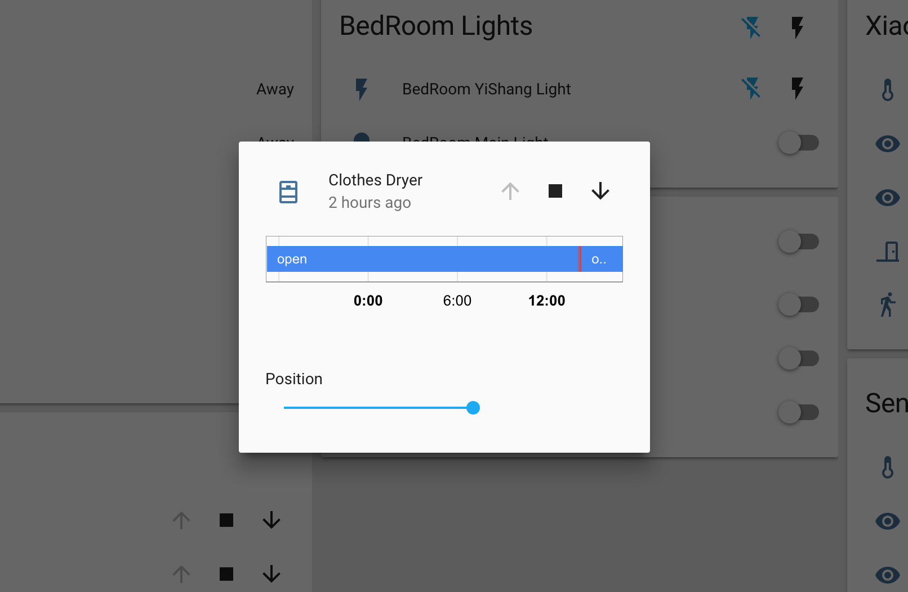

Position 100 means to lower down the rack to the bottom.

## Video


