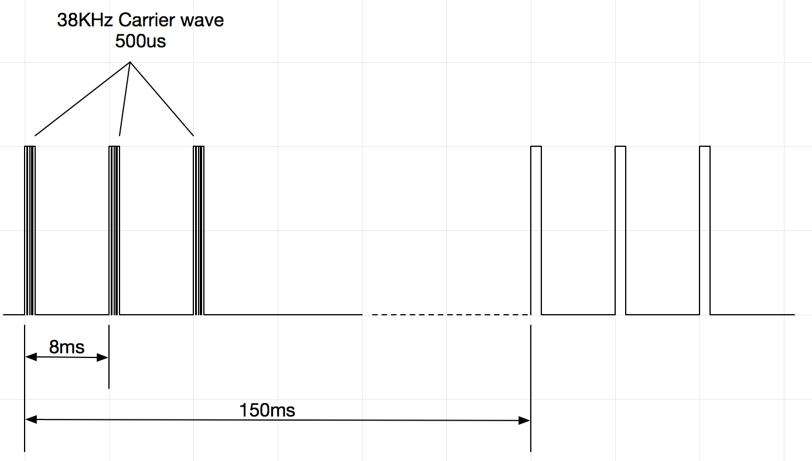
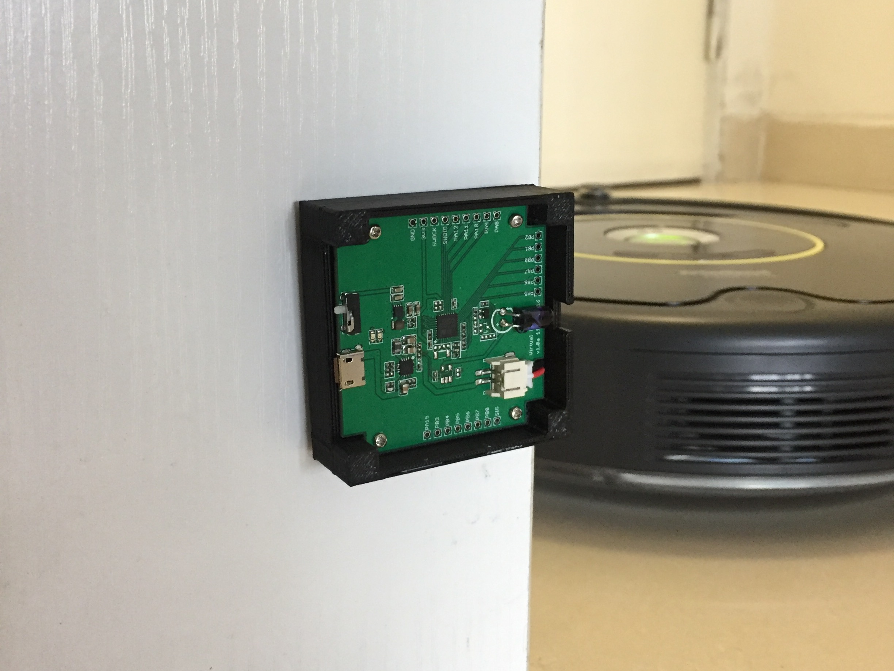
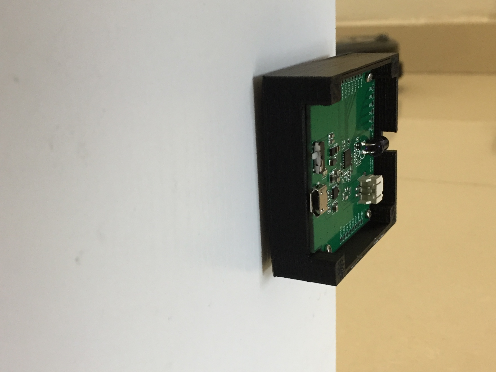

I need more virtual walls for my iRobot Roomba 650, and I find that it's not too complicated to make that. So I did some electronic monitoring and software tinkering, then I successfully made several ones - working good.

<!-- more -->

#### The IR protocol

Here's my research, maybe different from some old discussions (maybe they're for series 4000 or newer 5), but this protocol is proved to be working for 650.

Let's struct the IR signal from small to big.

- The smallest unit is a 38KHz PWM with 50% duty
- Then the PWM continues for 500us, call this A
- Then A * 3, period 8ms, call this 3 pulses B
- Then B repeats every 150ms...

#### The hardware

- stm32L011 - Ultra low power MCU
- ETA6003 - battery charging
- ETA3410 - battery voltage to 3.3V regular
- TSAL6200 - emitter
- Battery 1000mAh

Avg current consumption is around 1mA, the battery is expected to power this little device for 1 month at least.

#### The software

Not open source😜

#### The enclosure

3D printed, have no time to laser cut a cover...

#### Images and video


